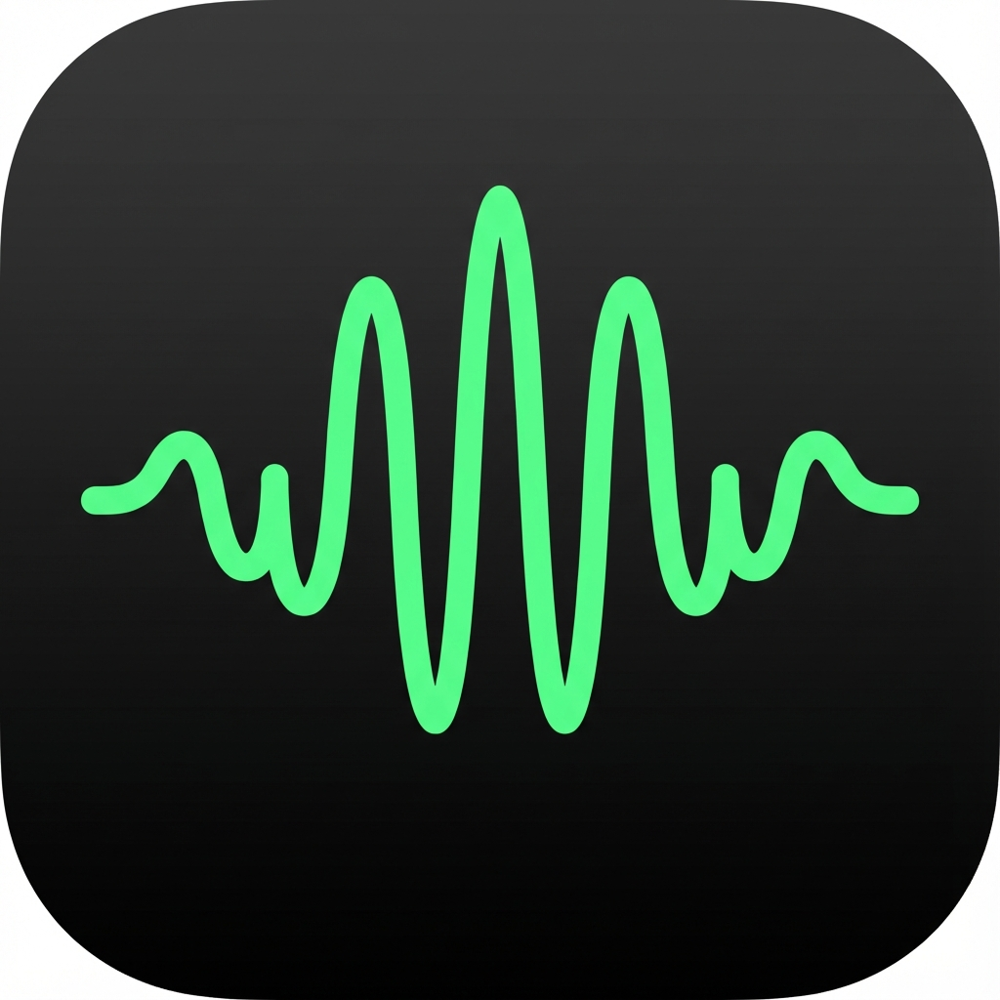

# Teraco Voice

高速・高精度な音声入力ツール



## 概要

Teraco Voiceは、Shiftキーを押すだけで音声入力ができる、Mac・Windows対応の音声入力アプリケーションです。
ローカルで動作するWhisper AIを使用し、プライバシーを保護しながら高精度な日本語音声認識を実現します。

## 特徴

- 🎤 **簡単操作**: Shiftキーを押しながら話すだけ
- 🚀 **高速処理**: ローカルで動作するため、インターネット接続不要
- 🎯 **高精度**: Whisper AIによる高精度な日本語認識
- 🔒 **プライバシー保護**: 音声データは外部に送信されません
- 💚 **美しいUI**: コンパクトで邪魔にならないデザイン
- 🌊 **リアルタイム波形**: 音声入力中の波形をリアルタイム表示

## システム要件

### macOS
- macOS 10.15 (Catalina) 以降
- Apple Silicon (M1/M2/M3) または Intel プロセッサ
- 500MB以上の空き容量

### Windows
- Windows 10 (64bit) 以降
- 500MB以上の空き容量

## インストール

詳しいインストール手順は [USER_GUIDE.md](USER_GUIDE.md) をご覧ください。

## 使い方

1. アプリを起動すると、画面上に小さなインジケーターが表示されます
2. **Shiftキー**を長押ししながら話す
3. 話し終わったらShiftキーを離す
4. 認識された文字が自動的に入力されます

## 開発

### セットアップ

```bash
# 依存関係のインストール
npm install

# Python環境のセットアップ
python3 -m venv venv
source venv/bin/activate  # Windows: venv\Scripts\activate
pip install -r requirements.txt

# Whisperモデルのダウンロード（初回のみ）
# アプリ起動時に自動的にダウンロードされます
```

### 開発モードで起動

```bash
npm start
```

### ビルド

詳しいビルド手順は [RELEASE.md](RELEASE.md) をご覧ください。

```bash
# macOS版
npm run build:mac

# Windows版
npm run build:win

# 両方
npm run build:all
```

## 技術スタック

- **Electron**: クロスプラットフォームデスクトップアプリ
- **Whisper**: OpenAIの音声認識AI
- **Python**: 音声処理バックエンド
- **Web Audio API**: リアルタイム波形表示
- **uiohook-napi**: グローバルキーボードフック
- **robotjs**: キーボード入力制御

## ライセンス

ISC

## 開発元

TERACO.LABO

## サポート

ご不明な点やサポートが必要な場合は、TERACO.LABOまでお問い合わせください。
